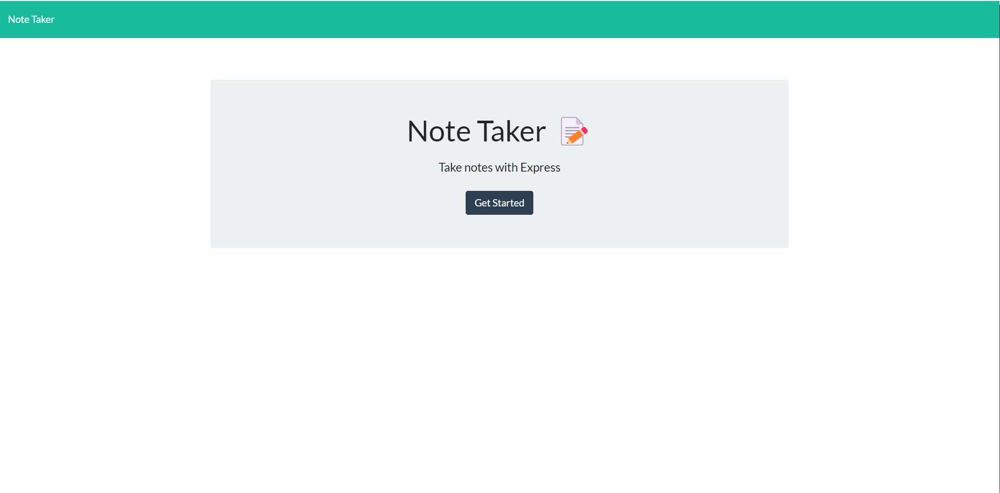

# Note Taker 

## Description 

This is a project to make and save notes on a server. It allows the notes to be created on one device, and pulled up on another.
Allowing the user to add to, remove from, and update notes as they need.
 
## Table of Contents
 
- [Installation](#installation)
- [Usage](#usage)
- [Credits](#credits)
- [License](#license)
- [Questions](#questions)

##  Installation 

n/a

## Usage 

https://creepy-demon-68174.herokuapp.com/notes

 
 

## Credits 

n/a 

## License 

MIT License 
Please refer to License in repository.  
 

## Questions 

If you have any questions or concerns, please reach out to Tab-Y at tlyoumans@gmail.com. 

